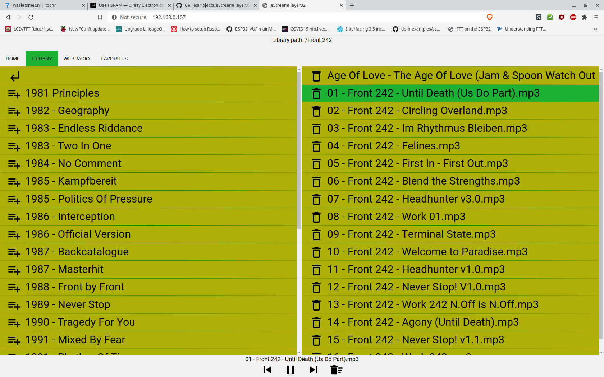

# eStreamPlayer32
An esp32 app to play webstreams and music from a lamp server. Based on ESP32-audioI2S, ESPAsyncWebServer and Reconnecting WebSocket. Plays MP3, icy and AAC streams. WIP.

## Setup:
1. Adjust your credentials in `wifi_setup.h`.
2. Copy the php script to your music folder on the server.
3. Change the following line in `index.htm` so it points to the script you just copied to your server:
 `var libraryURL="http://192.168.0.50/muziek/ESP32.php";`
4. Use (in a terminal) xxd to convert `index.htm` to a C style header file:
 `xxd -i index.htm > index_htm.h`
5. Change the first line in `index_htm.h` to: `const uint8_t index_htm[] = {`
 and change the last line to: `const unsigned int index_htm_len = xxxxxx;`
where you leave the number xxxxxx unchanged.
6. Flash the sketch to your esp32. Set `Tools->Core Debug Level->Info` before you flash so you can grab the ip adress from the serial port.
7. Browse to the ip address shown in the serial port.

## Software needed:

- [ESP32-audioI2S](https://github.com/schreibfaul1/ESP32-audioI2S) (GNU General Public License v3.0)
- [ESPAsyncWebServer](https://github.com/me-no-dev/ESPAsyncWebServer) (Not licensed)

## Libraries used in the web interface:

- The used icons are from [material.io](https://material.io/tools/icons/?style=baseline) and are [available under Apache2.0 license](https://www.apache.org/licenses/LICENSE-2.0.html).
- [Reconnecting WebSocket](https://github.com/joewalnes/reconnecting-websocket) which is [avaiable under MIT licence](https://github.com/joewalnes/reconnecting-websocket/blob/master/LICENSE.txt).
- [Google Roboto font](https://fonts.google.com/specimen/Roboto) which is [available under Apache2.0 license](https://www.apache.org/licenses/LICENSE-2.0.html).
- [jQuery 3.4.1](https://code.jquery.com/jquery-3.4.1.js) which is [available under MIT license](https://jquery.org/license/).
