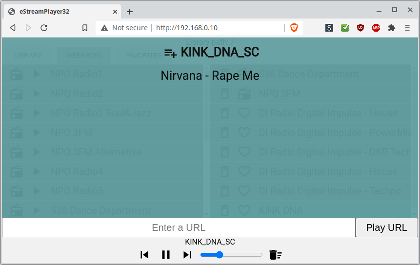
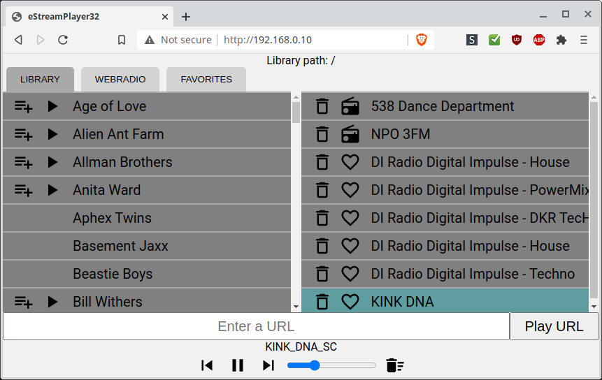
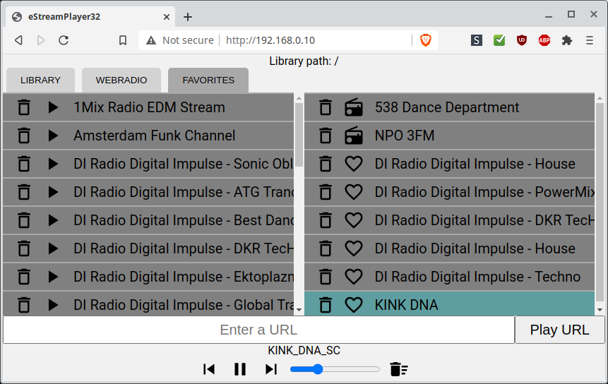

#  eStreamPlayer32

[](https://app.codacy.com/gh/CelliesProjects/eStreamPlayer32?utm_source=github.com&utm_medium=referral&utm_content=CelliesProjects/eStreamPlayer32&utm_campaign=Badge_Grade)

An web-based esp32 program to play webradio and mp3/aac files from a lamp or llmp server.

-  Control eStreamPlayer with your phone, pc or tablet.
-  Play your local files.
-  Play preset radio stations.
-  Add new urls and save them to favorites.

Sound output comes from an i2s dac.<br>Currently <b>generic i2s dacs</b> (with `BCK`, `WS` and `DOUT` pins), <b>M5Stack Node</b> and <b>AI Thinker A1S AudioKit</b> are supported.

When flashed to an M5Stack with the Node base you can see some information on the display.

The M5 with its slick design and rounded corners also has a rather good [WAF](https://en.wikipedia.org/wiki/Wife_acceptance_factor).


###  Limitations

eStreamPlayer is written for playback over http.

The esp32 does not speak NFS or SMB which are common ways to share files over a network.
<br>Instead eStreamPlayer uses a php script on the server to navigate the music folders. 
<br>Copy this script to the server to use your music library.

#### This is totally insecure and should only be used on a LAN! 

But if you don't have a local music server you can still use eStreamPlayer to tune in to web radio stations and add your own radio stations to presets and favorites.

###  Web-interface screenshots

#### File info overlay



#### LIBRARY tab



#### WEBRADIO tab


#### FAVORITES tab



### Setup

Use [ESP32 Arduino Core v1.0.5](https://github.com/espressif/arduino-esp32/releases/tag/1.0.5) or later to compile.

1.  Download the [latest eStreamPlayer release](https://github.com/CelliesProjects/eStreamPlayer32/releases/latest).
2.  Install the drivers for your dac. See [supported hardware](#supported-hardware).
3.  Copy the php script to your music folder on the server.
4.  Open `system_setup.h` and set your wifi credentials, select a board and set `SCRIPT_URL` to the php script location.
5.  Select your board type or `ESP32 Dev Module` as board.
6.  Flash the sketch to your esp32. Set `Tools->Core Debug Level->Info` before you flash so you can grab the ip address from the serial port.
7.  On first boot or after a flash erase the fatfs has to be formatted. This will take a couple of seconds.
<br>Flashing an update will not erase the fatfs data.
<br>You can monitor the boot progress on the serial port.
8.  Browse to the ip address shown on the serial port.

### Partition table
The file `partitions.csv` in the sketch folder overrides any partition you select in the Arduino IDE. If you want another partition table, you can rename, delete or edit this file. See https://github.com/espressif/arduino-esp32/issues/2258 and https://github.com/espressif/arduino-esp32/pull/3328.  
<br>The included partition table sets a 2MB app space with 2MB fatfs and no ota.

### Supported hardware

Select a board or dac by uncommenting the relevant line in `system_setup.h`.

-  <b>Generic i2s dac</b> - Select `GENERIC_I2S_DAC` as board.<br>For dacs that only need `BCK`, `WS` and `DOUT` and no driver setup.<br>Default pins are `BCK` = 21, `WS` = 26, `DOUT` = 22.
-  <b>M5 Stack Node</b> - Select `M5STACK_NODE` to compile for M5Stack Node with `MCLK` on `GPIO0`.<br>You need the [wm8978-esp32](https://github.com/CelliesProjects/wm8978-esp32) library for this dac.
-  <b>A1S Audio Kit</b> - Select `A1S_AUDIO_KIT` to compile for ESP32-A1S Audio Kit.<br>You need the [AC101](https://github.com/Yveaux/AC101) library for this dac.

### Software needed

-  [ESP32-audioI2S](https://github.com/schreibfaul1/ESP32-audioI2S) (GNU General Public License v3.0)
-  [AsyncTCP](https://github.com/me-no-dev/AsyncTCP) (LGPL-3.0 License)
-  [ESPAsyncWebServer](https://github.com/me-no-dev/ESPAsyncWebServer) (LGPL-3.0 License)
-  A [lamp](https://en.wikipedia.org/wiki/LAMP_%28software_bundle%29) or llmp webstack to serve local files.
<br>Apache2 and lighttpd were tested and should work. The php script should be fairly version agnostic.
<br>Note: Mp3 and aac files should have the `Content-Type: audio/mpeg` http headers set or the decoder will not recognise the files.

### Libraries used in the web interface

-  The used icons are from [material.io](https://material.io/tools/icons/?style=baseline) and are [available under Apache2.0 license](https://www.apache.org/licenses/LICENSE-2.0.html).
-  [Reconnecting WebSocket](https://github.com/joewalnes/reconnecting-websocket) which is [available under MIT licence](https://github.com/joewalnes/reconnecting-websocket/blob/master/LICENSE.txt).
-  [Google Roboto font](https://fonts.google.com/specimen/Roboto) which is [available under Apache2.0 license](https://www.apache.org/licenses/LICENSE-2.0.html).
-  [jQuery 3.4.1](https://code.jquery.com/jquery-3.4.1.js) which is [available under MIT license](https://jquery.org/license/).

````
MIT License

Copyright (c) 2020 Cellie

Permission is hereby granted, free of charge, to any person obtaining a copy
of this software and associated documentation files (the "Software"), to deal
in the Software without restriction, including without limitation the rights
to use, copy, modify, merge, publish, distribute, sublicense, and/or sell
copies of the Software, and to permit persons to whom the Software is
furnished to do so, subject to the following conditions:

The above copyright notice and this permission notice shall be included in all
copies or substantial portions of the Software.

THE SOFTWARE IS PROVIDED "AS IS", WITHOUT WARRANTY OF ANY KIND, EXPRESS OR
IMPLIED, INCLUDING BUT NOT LIMITED TO THE WARRANTIES OF MERCHANTABILITY,
FITNESS FOR A PARTICULAR PURPOSE AND NONINFRINGEMENT. IN NO EVENT SHALL THE
AUTHORS OR COPYRIGHT HOLDERS BE LIABLE FOR ANY CLAIM, DAMAGES OR OTHER
LIABILITY, WHETHER IN AN ACTION OF CONTRACT, TORT OR OTHERWISE, ARISING FROM,
OUT OF OR IN CONNECTION WITH THE SOFTWARE OR THE USE OR OTHER DEALINGS IN THE
SOFTWARE.
````
