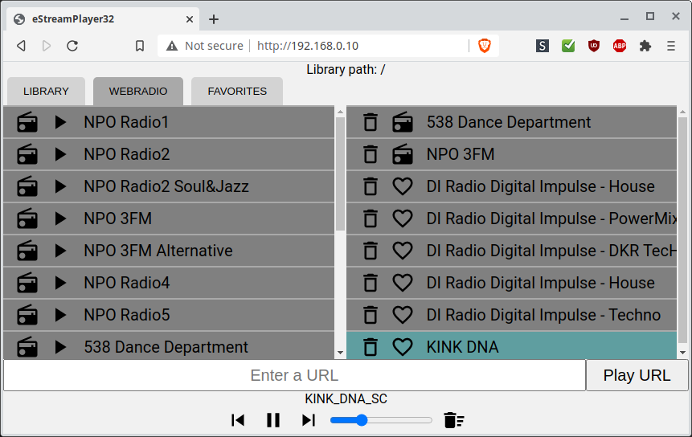

# eStreamPlayer32

An web-based esp32 playlist app to play webstreams and music files from a lamp or llmp server.

You need write access to the music folder because the esp32 does not speak 'real' filesystems and uses a script on the server to navigate the music folders.

Based on ESP32-audioI2S, ESPAsyncWebServer and Reconnecting WebSocket.

- Play MP3 and AAC files from a server.
- Play preset radio stations.
- Add new urls.
- Save new urls to favorites.

Below some screenshots from the different tabs. Browser area is on the left. Playlist is on the right.

##### The HOME tab:


##### The LIBRARY tab:


##### The WEBRADIO tab:


##### The FAVORITES tab:


## Setup:

1. Copy the php script to your music folder on the server.
2. Adjust your credentials in `wifi_setup.h`.
3. Change the following line in `index.htm` so it points to the script you just copied to your server:
<br>`var libraryURL="http://192.168.0.50/muziek/ESP32.php";`
4. Use (in a terminal) xxd to convert `index.htm` to a C style header file:
<br>`xxd -i index.htm > index_htm.h`
5. Change the first line in `index_htm.h` to: `const uint8_t index_htm[] = {`
<br>and change the last line to: `const unsigned int index_htm_len = xxxxxx;`
where you leave the number xxxxxx unchanged.
6. Select `ESP32 Dev Module` as board. This board has additional partition schemes which we need in the next step.
7. Set `Tools->Partition Scheme` to `No OTA(2MB APP/2MB FATFS)` otherwise the app won't fit in flash memory.
8. Flash the sketch to your esp32. Set `Tools->Core Debug Level->Info` before you flash so you can grab the ip address from the serial port.
9. Browse to the ip address shown in the serial port.

## Hardware needed:

A supported board or dac.

Select a board or dac by uncommenting the relevant line in `eStreamPlayer32.ino`.

- <b>UDA1334A</b> - Select `GENERIC_I2S_DAC` as board.<br>For dacs that only need `I2S_BCK` `I2S_WS` and `I2S_DOUT`.
- <b>M5 Stack Node</b> - Select `M5STACK_NODE` to compile for M5Stack Node with MCLK on GPIO0.
- <b>A1S Audio Kit</b> - Select `A1S_AUDIO_KIT` to compile for ESP32-A1S Audio Kit.

## Software needed:

- [ESP32-audioI2S](https://github.com/schreibfaul1/ESP32-audioI2S) (GNU General Public License v3.0)
- [ESPAsyncWebServer](https://github.com/me-no-dev/ESPAsyncWebServer) (Not licensed)
- A [lamp](https://en.wikipedia.org/wiki/LAMP_%28software_bundle%29) or llmp webstack. MySQL is not used.
<br>Apache2 and lighttpd were tested and should work. The php script should be fairly version agnostic.
<br>Note: Mp3 and aac files should have the `Content-Type: audio/mpeg` http headers set or the decoder will not recognise the files.

## Libraries used in the web interface:

- The used icons are from [material.io](https://material.io/tools/icons/?style=baseline) and are [available under Apache2.0 license](https://www.apache.org/licenses/LICENSE-2.0.html).
- [Reconnecting WebSocket](https://github.com/joewalnes/reconnecting-websocket) which is [avaiable under MIT licence](https://github.com/joewalnes/reconnecting-websocket/blob/master/LICENSE.txt).
- [Google Roboto font](https://fonts.google.com/specimen/Roboto) which is [available under Apache2.0 license](https://www.apache.org/licenses/LICENSE-2.0.html).
- [jQuery 3.4.1](https://code.jquery.com/jquery-3.4.1.js) which is [available under MIT license](https://jquery.org/license/).

````
MIT License

Copyright (c) 2020 Cellie

Permission is hereby granted, free of charge, to any person obtaining a copy
of this software and associated documentation files (the "Software"), to deal
in the Software without restriction, including without limitation the rights
to use, copy, modify, merge, publish, distribute, sublicense, and/or sell
copies of the Software, and to permit persons to whom the Software is
furnished to do so, subject to the following conditions:

The above copyright notice and this permission notice shall be included in all
copies or substantial portions of the Software.

THE SOFTWARE IS PROVIDED "AS IS", WITHOUT WARRANTY OF ANY KIND, EXPRESS OR
IMPLIED, INCLUDING BUT NOT LIMITED TO THE WARRANTIES OF MERCHANTABILITY,
FITNESS FOR A PARTICULAR PURPOSE AND NONINFRINGEMENT. IN NO EVENT SHALL THE
AUTHORS OR COPYRIGHT HOLDERS BE LIABLE FOR ANY CLAIM, DAMAGES OR OTHER
LIABILITY, WHETHER IN AN ACTION OF CONTRACT, TORT OR OTHERWISE, ARISING FROM,
OUT OF OR IN CONNECTION WITH THE SOFTWARE OR THE USE OR OTHER DEALINGS IN THE
SOFTWARE.
````
